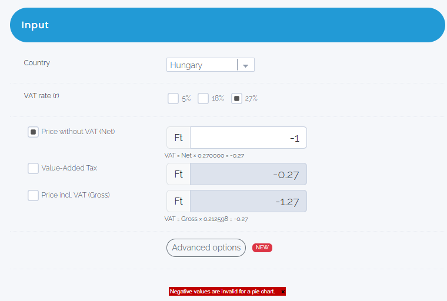

# Negative input is accepted and calculation is performed

* Environment: DEV
* XRayId: GLBDBO-12345
* Severity: Medium
* Browser type: Chrome
* Affected version: 1.20

Description:

```
In case of negative input the application makes calculation. In this case error message should appear and calculation should not be made.
```

### Test steps

1. Select country "Hungary"
2. Select VAT rate "27%"
3. Select calculation type "Price without VAT (Net)"
4. Enter value "-1"

### Expected result

```
The application should reject the negative input and should display error message.
```

### Actual result

```
The application accepts the value and makes calculation
```

### Screenshot



### Notes

```
"Negative values are invaid for pie chart" error message is visible for pie chart, but calculation should not be made and negative input should be rejected
```

# Questions for PO

Application should be prepared for the following scenarios:
1. non-numeric values (such as: asd)
2. special characters (such as: *, -, !)
3. zero as input parameter

Expected behaviour should be clarified in the requirements or acceptance criteria. These cases are potential risks for the application.